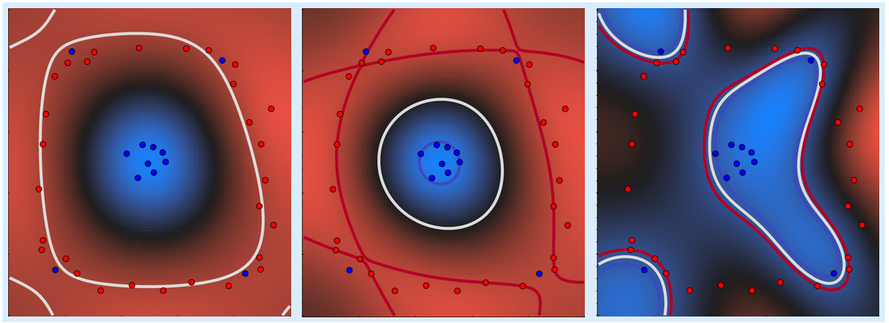
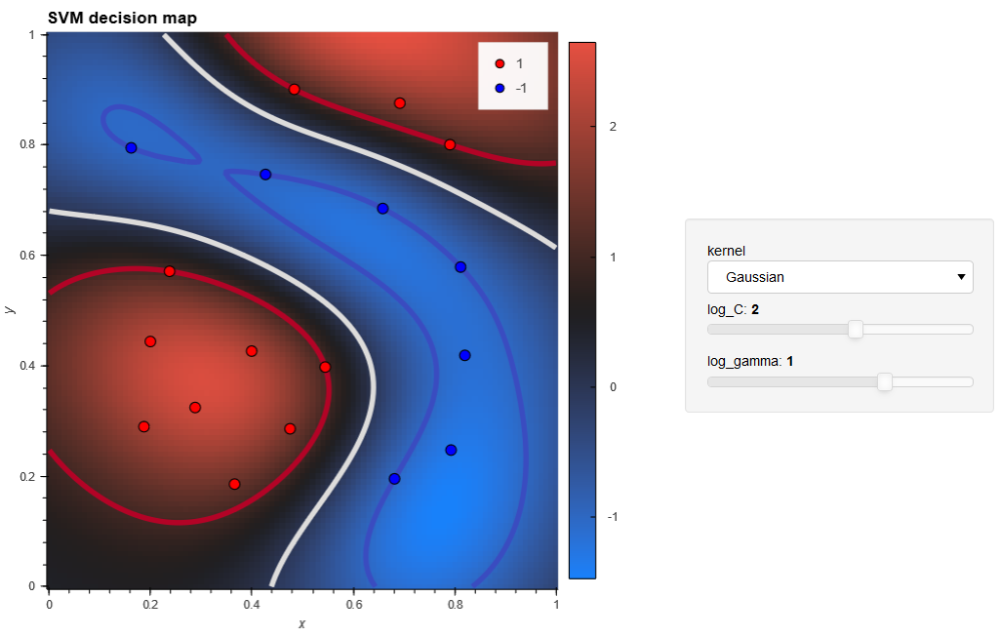

# SVM playground

   
   

-----------------

A playground to experiment with **Support Vector Machine** models in a visual way. Just use the binder link above to launch it!

Alternatively, if you want to run this playground locally, install a [python Anaconda distribution](https://www.anaconda.com/products/individual) and then create the environment using the provided environment file:

    conda env create -f environment.yml

After this, log into the environment

    conda activate svm-playground

and start Jupyter notebook with

    jupyter notebook

Open the notebook named `svmgui.ipynb` and you are ready to go!
